# MyTrips

> **DISCLAIMER**: The integrations test don't run in parallel. The failed tests must be re-run individually.

## Overview

This API stores and retrieves data about leisure trips, including flights, hosting and destinations.

## Requirements

- With an open theme.
- Build a **C# API** with access to a **SQL Server** database.
- Just a service where I can **store and retrieve data** of some type chosen by you using **HTTP** and **JSON**
- There are no restrictions on what can be developed.
- It is **essential** that you host your API and database on **Microsoft Azure** (within the free tier)
- It is also **essential** that you document your API.
- Use your creativity.

## Technologies

- Framework: ASP.NET 8
- Database: SQL Server
- ORM: RepoDB
- Logging: Serilog
- Documentation: Swagger/OpenAPI
- Mapping: AutoMapper
- Testing: xUnit, Moq, Bogus and Fluent Assertions
- Business rules: FLuent Validation

## Tools

- Visual Studio 2022 Community Edition
- VSCode
- SQL Server Management Studio
- ReSharper
- Insomnia
- GitKraken
- Astah UML

## Use Case Diagrams

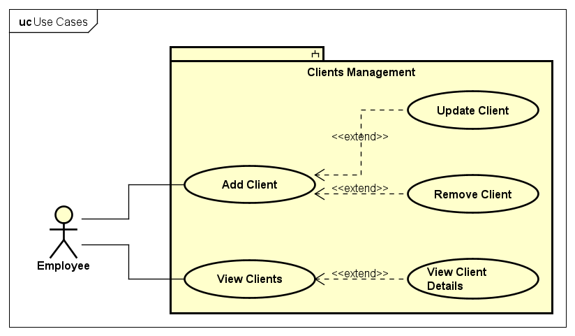

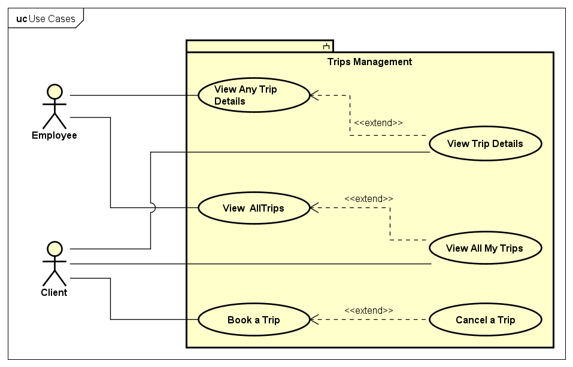

## ER Model

### Clients Table

|     | Field | Type          | Other Constraints |
| --- | ----- | ------------- | ----------------- |
| PK  | Id    | INT           | NOT NULL          |
|     | Name  | NVARCHAR(100) | NOT NULL          |
|     | Email | NVARCAHR(100) | NOT NULL, UNIQUE  |

### Trips Table

|     | Field            | Type | Other Constraints      |
| --- | ---------------- | ---- | ---------------------- |
| PK  | Id               | INT  | NOT NULL               |
|     | StartDate        | DATE | NOT NULL               |
|     | EndDate          | DATE | NULL                   |
| FK  | ClientId         | INT  | REFERENCES Clients(Id) |
| FK  | InboundFlightId  | INT  | REFERENCES Flight(Id)  |
| FK  | OutboundFlightId | INT  | REFERENCES Flight(Id)  |
| FK  | HotelId          | INT  | REFERENCES Hotels(Id)  |

### Flights Table

|     | Field             | Type          | Other Constraints |
| --- | ----------------- | ------------- | ----------------- |
| PK  | Id                | INT           | NOT NULL          |
|     | FlightNumber      | NVARCHAR      | NOT NULL          |
|     | DepartureAirport  | NVARCHAR(100) | NOT NULL          |
|     | ArrivalAirport    | NVARCHAR(100) | NOT NULL          |
|     | DepartureDateTime | DATETIME      | NOT NULL          |
|     | ArrivalDateTime   | DATETIME      | NOT NULL          |
|     | Price             | DECIMAL       | NOT NULL          |

### Hotels Table

|     | Field         | Type          | Other Constraints |
| --- | ------------- | ------------- | ----------------- |
| PK  | Id            | INT           | NOT NULL          |
|     | Name          | NVARCHAR(100) | NOT NULL          |
|     | Rating        | INT           | NULL              |
| FK  | DestinationId | INT           | NOT NULL          |
|     | Price         | DECIMAL       | NOT NULL          |

### Destinations Table

|     | Field | Type          | Other Constraints |
| --- | ----- | ------------- | ----------------- |
| PK  | Id    | INT           | NOT NULL          |
|     | Name  | NVARCAHR(100) | NOT NULL          |

## Component Diagrams

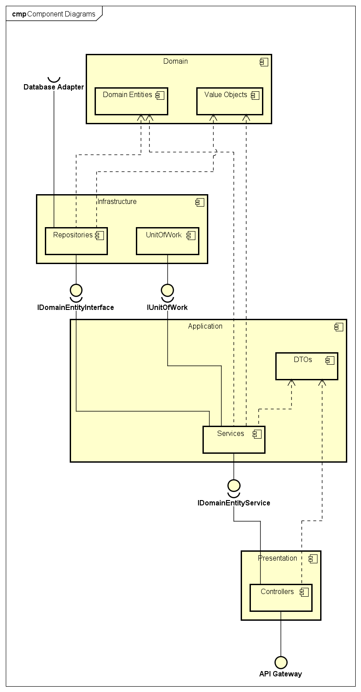

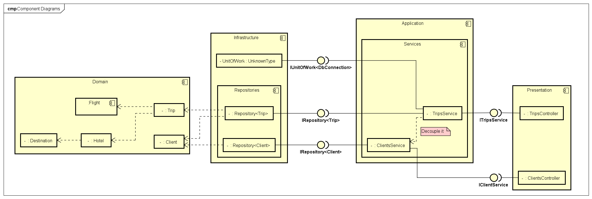

## Sequence Diagrams

### Clients

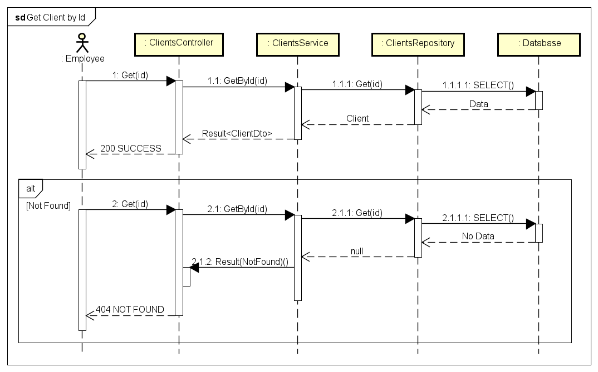

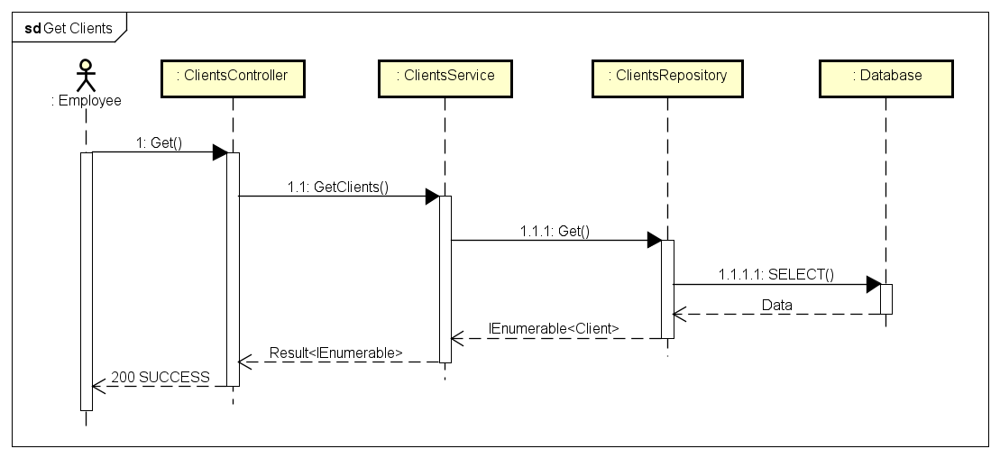

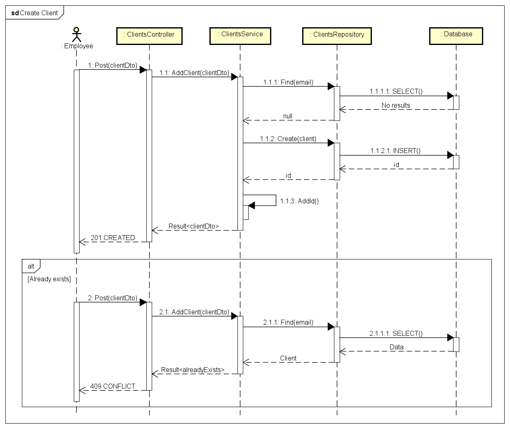

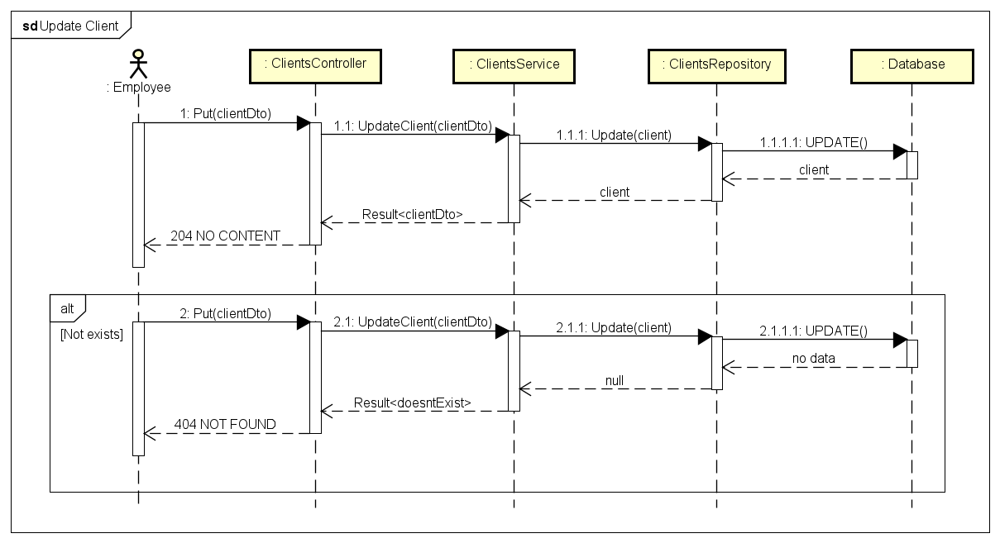

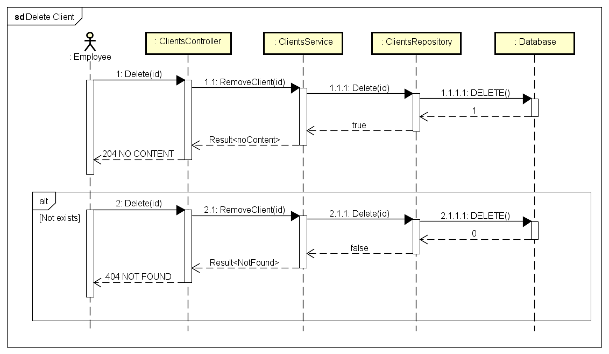

### Trips

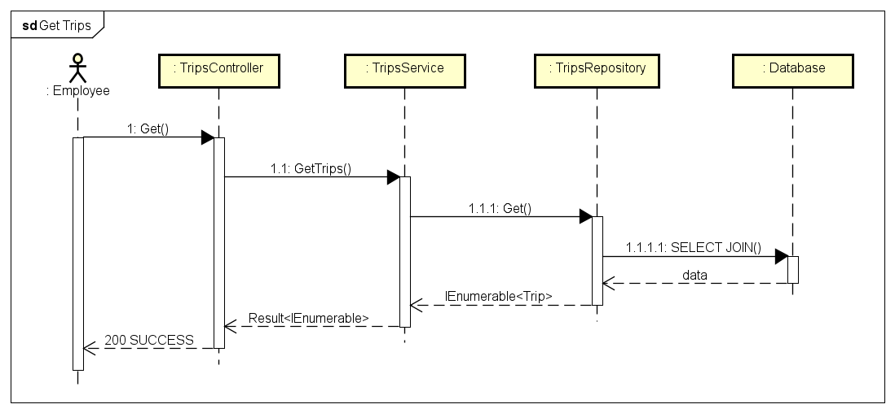

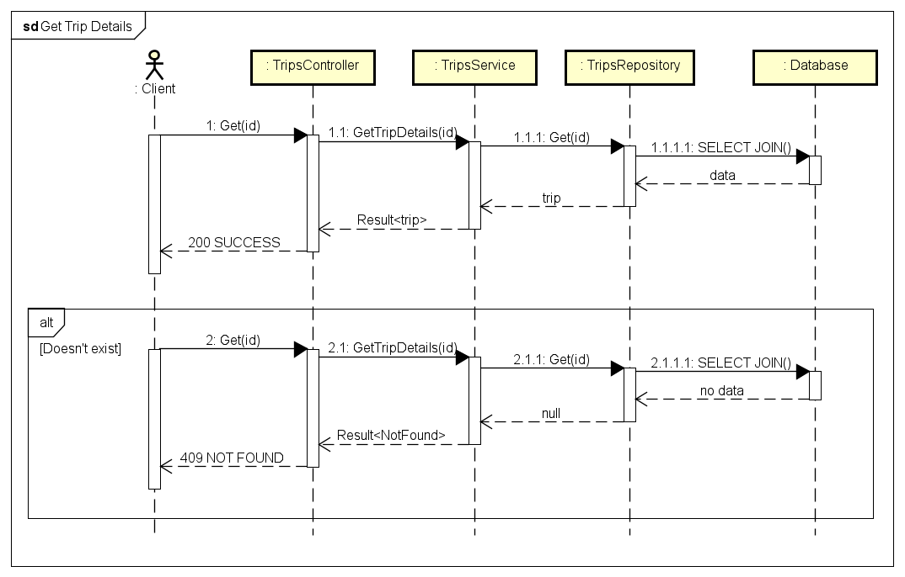

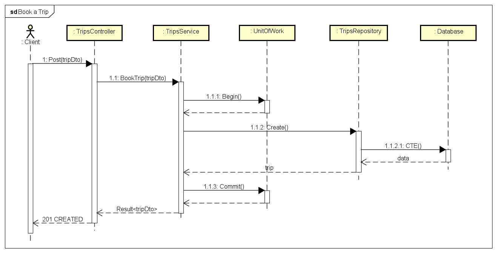

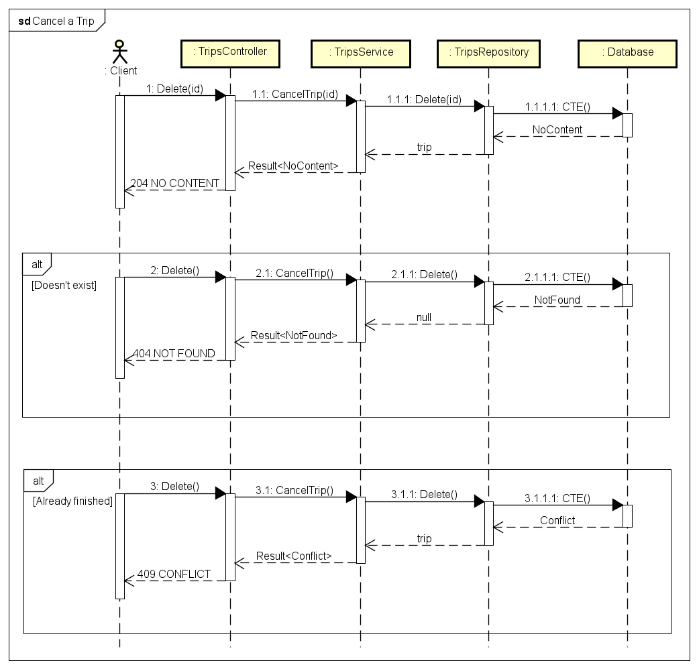

## How to test

Use the Insomnia files on the `docs/api` folder or the Swagger UI. The URL is `https://mytrips.azurewebsites.net/api/`

## Set up locally

### 1. Clone the repository

Open an integrated terminal and run the following commands:

```bash
git clone https://github.com/filimor/api-ploomes.git
cd api-ploomes
```

### 2. Set up the Backend environment

Open an integrated terminal and run the following commands:

```bash
cd api
dotnet restore
dotnet build
```

### 3. Set up the databases

1. Open the SQL Server Management Studio (SSMS).
2. Connect to the SQL Server instance.
3. Create the `MyTrips` database.
4. Run the script in: `/db`.

### 4. Set up the environment variables

Create a file named `appsettings.json` (and `appsettings.Development.json`, optionally) with the following structure:

```json
{
  "Logging": {
    "LogLevel": {
      "Default": "Information",
      "Microsoft.AspNetCore": "Warning",
      "Microsoft.AspNetCore.HttpLogging": "Information"
    }
  },
  "ConnectionStrings": {
    "MyTripsDb": "",
    "AuthDb": ""
  },
  "Authentication": {
    "JwtSecret": "XXXXXXX"
  },
  "AppSetting": {
    "ConnectionString": "",
    "CommandTimeout": 30,
    "CacheItemExpiration": 60
  }
}
```

The connection strings for the 3 strings above are the same.

- **Local**

```plaintext
Data Source=localhost;Initial Catalog=MyTrips;User ID=mytrips_admin;Password=admin;Connect Timeout=30;Encrypt=True;Trust Server Certificate=True;Application Intent=ReadWrite;Multi Subnet Failover=False
```

- **Azure**

```plaintext
Data Source=mytrips.database.windows.net;Initial Catalog=MyTripsDb;User ID=XXXXXXX;Password=XXXXXXX;Connect Timeout=30;Encrypt=True;Trust Server Certificate=True;Application Intent=ReadWrite;Multi Subnet Failover=False
```

> **DON'T FORGET** to replace the username and the password.
